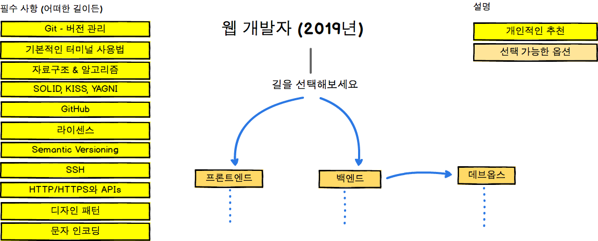
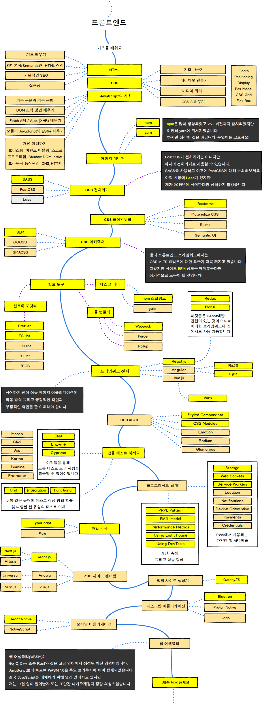
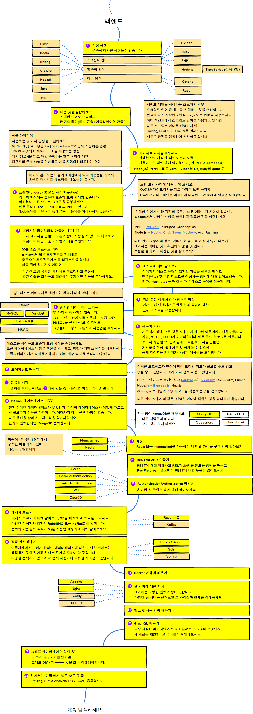
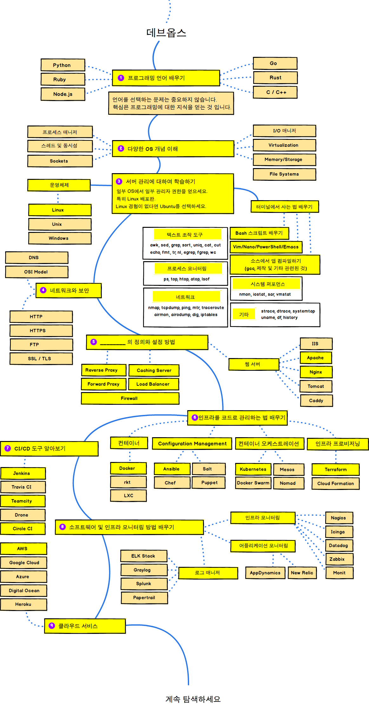

  <h2 align="center">🕸️ 웹 개발자 로드맵</h2>
  

    2019년 웹 개발자가 되기 위한 로드맵
  

  

   <a href="https://roadmap.sh">RoadMap Site 🔗</a>
  

## 소개 
[Fork 👉🏻 kamranahmedse](https://github.com/kamranahmedse/developer-roadmap)

## 프론트엔드 로드맵

## 백엔드 로드맵

## 데브옵스 로드맵

